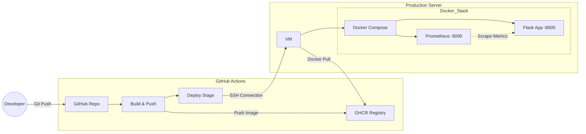

# FOX - Metal Gear Solid Trivia

<p align="center">
  
</p>

FOX is a simple, single-page web application that presents fun facts of the Metal Gear Solid saga. It is built with Flask and designed with a focus on modern DevOps practices, including containerization, CI/CD, and monitoring.

## Features

- Single-page app with a Metal Gear theme.
- Built with Python and the Flask micro-framework.
- Exposes application metrics for Prometheus monitoring.
- Fully containerized with Docker and Docker Compose for easy deployment and scalability.
- Automated CI/CD pipeline using GitHub Actions for building and deploying the application.

## Technology Stack

- **Backend**: Python 3, Flask
- **Frontend**: HTML, CSS, JavaScript
- **Containerization**: Docker, Docker Compose
- **CI/CD**: GitHub Actions
- **Monitoring**: Prometheus

## Architecture Overview

The project consists of two main containerized services managed by Docker Compose:

1.  **Flask App**: The core web application that serves the trivia page and exposes a `/metrics` endpoint.
2.  **Prometheus**: A monitoring service configured to scrape the metrics from the Flask application.

The entire deployment process is automated through a CI/CD pipeline, as illustrated below.

### Deployment Flow



### CI/CD Pipeline Explained

1.  A developer pushes code changes to the `main` branch of the GitHub repository.
2.  A GitHub Actions workflow is triggered automatically.
3.  The workflow builds a new Docker image of the Flask application.
4.  The newly built image is pushed to the GitHub Container Registry (GHCR).
5.  The 'Deploy' stage establishes an SSH connection to the production server (e.g., an AWS EC2 instance or any VPS).
6.  On the server, a script pulls the latest Docker image from GHCR and restarts the services using `docker-compose up -d --build` to apply the updates seamlessly.

## Monitoring

- The Flask application uses the `prometheus-flask-exporter` library to expose a `/metrics` endpoint.
- The Prometheus container is configured via `prometheus.yml` to periodically scrape this endpoint, collecting application-level metrics such as request latency, response counts, and custom business metrics.
- The Prometheus dashboard is accessible for visualizing and querying these metrics.

## Getting Started

To run this project locally, you need Docker and Docker Compose installed.

1.  **Clone the repository:**
    ```bash
    git clone https://github.com/your-username/FOX.git
    cd FOX
    ```

2.  **Start the services:**
    ```bash
    docker-compose up
    ```

3.  **Access the application:**
    - The trivia game will be available at [http://0.0.0.0:8000](http://0.0.0.0:8000).
    - The Prometheus dashboard will be available at [http://0.0.0.0:9090](http://0.0.0.0.0:9090).

